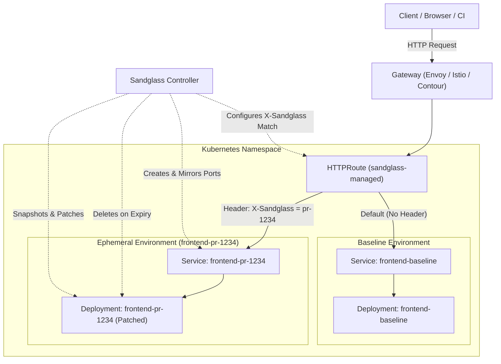

# ⏳ Sandglass

[](https://golang.org)
[](https://gateway-api.sigs.k8s.io/)
[](https://opensource.org/licenses/Apache-2.0)

**Sandglass** is a lightweight Kubernetes operator for instant, cost-effective ephemeral preview environments with header-based traffic routing powered by the [Kubernetes Gateway API](https://gateway-api.sigs.k8s.io/).

---

## 💡 Why Sandglass?

Spinning up full duplicate preview environments or dedicated namespaces for every Pull Request is slow, resource-heavy, and expensive. 

**Sandglass** takes a different approach:
- **Share baseline services**: Keep your baseline workloads running in a shared staging or dev namespace.
- **Clone only what you need**: Sandglass clones the baseline Deployment, applies your pull request image and environment variables using **Strategic Merge Patch**, and isolates the workload.
- **Route via HTTP Headers**: Automatically configures Gateway API `HTTPRoute` resources to route requests carrying a specific header (e.g. `X-Sandglass: pr-1234`) directly to the ephemeral version, while unmodified traffic continues to the baseline.
- **Automatic TTL Expiry**: Automatically tears down ephemeral workloads after a specified duration (`ttl: "2h"`), ensuring zero resource waste.

---

## 🏗️ Architecture



---

## ✨ Features

- ⚡ **Header-Based Dynamic Routing**: Zero-downtime routing via standard Kubernetes Gateway API `HTTPRoute` rules (`X-Sandglass: <header-value>`).
- 🧩 **Strategic Merge Pod Patching**: Seamlessly override container images, inject environment variables, or adjust resource limits per preview.
- ⏳ **Automated TTL Garbage Collection**: Define how long an ephemeral instance should live (`ttl: "1h30m"`); Sandglass automatically purges expired resources.
- 🛡️ **Full Workload Isolation**: Auto-generates unique pod labels and service selectors (`app.kubernetes.io/env: ephemeral`), preventing baseline service selector crossover.
- 📸 **Baseline Snapshotting**: Freezes the baseline workload configuration upon creation, ensuring deterministic, immutable preview environments.
- 📊 **Kubernetes-Native Observability**: Standard `metav1.Condition` types (`Ready`, `BaselineNotFound`, `DeploymentNotReady`), `status.phase`, and Prometheus metrics.

---

## 📋 Prerequisites

- **Kubernetes**: `v1.26+`
- **Gateway API**: Gateway API CRDs (`v1`) and a compliant controller (such as [Envoy Gateway](https://gateway.envoyproxy.io/), [Istio](https://istio.io/), [Cilium](https://cilium.io/), or [Traefik](https://traefik.io/)).
- **Task Runner**: [`mise`](https://mise.jdx.dev/) (for local development and building).

---

## 🚀 Quickstart

### 1. Install Sandglass

#### Option A: Quick Install (YAML Bundle)
```bash
kubectl apply -f https://raw.githubusercontent.com/mjenek/sandglass/main/dist/install.yaml
```

#### Option B: Using `mise` from Source
```bash
# Clone repository
git clone https://github.com/mjenek/sandglass.git
cd sandglass

# Install CRDs into your cluster
mise run install

# Deploy the controller
mise run deploy IMG=controller:latest
```

---

### 2. Deploy a Baseline Application

Apply a standard baseline Deployment and Service:

```yaml
apiVersion: apps/v1
kind: Deployment
metadata:
  name: frontend-baseline
  namespace: default
spec:
  replicas: 1
  selector:
    matchLabels:
      app: frontend
  template:
    metadata:
      labels:
        app: frontend
    spec:
      containers:
      - name: web
        image: traefik/whoami:v1.9.0
        ports:
        - containerPort: 80
---
apiVersion: v1
kind: Service
metadata:
  name: frontend-baseline
  namespace: default
spec:
  selector:
    app: frontend
  ports:
  - port: 80
    targetPort: 80
```

---

### 3. Create an Ephemeral Environment

Create an `EphemeralDeployment` targeting the baseline with a PR image, custom environment variable, and a 2-hour TTL:

```yaml
apiVersion: sandglass.io/v1alpha1
kind: EphemeralDeployment
metadata:
  name: frontend-pr-1234
  namespace: default
spec:
  targetDeployment: "frontend-baseline"
  replicas: 1
  ttl: "2h"
  routing:
    headerName: "X-Sandglass"
    headerMatch: "pr-1234"
    gatewayRef: "main-gateway"
  podPatch:
    spec:
      containers:
      - name: web
        image: traefik/whoami:v1.10.0
        env:
        - name: FEATURE_FLAG_NEW_CHECKOUT
          value: "true"
```

Apply the manifest:
```bash
kubectl apply -f frontend-pr-1234.yaml
```

Check the status:
```bash
kubectl get ephemeraldeployments
```
```text
NAME               TARGET              HEADERKEY     HEADERVALUE   PHASE   ACTIVE   EXPIRESAT
frontend-pr-1234   frontend-baseline   X-Sandglass   pr-1234       Ready   true     2026-08-28T19:32:00Z
```

---

### 4. Test Traffic Routing

Assuming your Gateway is reachable at `http://gateway.local`:

```bash
# Baseline traffic (No header) -> Routes to frontend-baseline
curl http://gateway.local/

# Ephemeral preview traffic (With header) -> Routes to frontend-pr-1234
curl -H "X-Sandglass: pr-1234" http://gateway.local/
```

---

## 📖 CRD Reference

### `EphemeralDeploymentSpec`

| Field | Type | Description | Required | Default |
|---|---|---|---|---|
| `targetDeployment` | `string` | Name of the baseline `Deployment` to clone. | **Yes** | - |
| `replicas` | `*int32` | Number of pods to provision for the preview environment. | No | `1` |
| `ttl` | `metav1.Duration` | Lifespan of the environment before auto-deletion (e.g. `30m`, `2h`, `1d`). | No | None (Persistent) |
| `routing` | `RoutingSpec` | Gateway API HTTPRoute ingress routing parameters. | No | Defaults to `X-Sandglass` matching metadata.name |
| `podPatch` | `corev1.PodTemplateSpec` | Strategic merge patch for the cloned PodTemplate (containers, images, envs, resources). | No | None |

### `RoutingSpec`

| Field | Type | Description | Required | Default |
|---|---|---|---|---|
| `headerName` | `string` | HTTP request header name used for traffic routing. | No | `"X-Sandglass"` |
| `headerMatch` | `string` | Value for the HTTP header that triggers routing. | No | Defaults to CR `metadata.name` |
| `gatewayRef` | `string` | Name of the Gateway API `Gateway` in the same namespace. | No | `"main-gateway"` |
| `servicePort` | `intstr.IntOrString` | Explicit target service port number or name. | No | Auto-detected from baseline service |

### `EphemeralDeploymentStatus`

| Field | Type | Description |
|---|---|---|
| `phase` | `string` | Current lifecycle state: `Provisioning`, `Ready`, or `Failed`. |
| `active` | `boolean` | Indicates whether the ephemeral environment is active and routing traffic. |
| `expiresAt` | `metav1.Time` | Timestamp when the environment will be automatically purged by the operator. |
| `conditions` | `[]metav1.Condition` | Detailed status conditions (`Ready`, `BaselineNotFound`, `DeploymentNotReady`, `RouteNotProgrammed`). |

---

## 🛠️ Development & Contributing

Sandglass uses [`mise`](https://mise.jdx.dev/) for task orchestration and tool management.

### Common Tasks

```bash
# Install tool dependencies (Go, kustomize, kind, golangci-lint)
mise install

# Run unit tests
mise run test

# Run linter
mise run lint

# Auto-fix linter issues
mise run lint-fix

# Regenerate CRDs and RBAC manifests
mise run manifests

# Regenerate DeepCopy code
mise run generate

# Run controller locally against active kubeconfig
mise run run

# Run end-to-end tests in an isolated Kind cluster
mise run test-e2e
```

### End-to-End Tests

The e2e suite automatically provisions a dedicated [Kind](https://kind.sigs.k8s.io/) cluster, sets up Envoy Gateway and the Gateway API controllers, builds the manager image, deploys the operator, and validates header routing, TTL teardown, and lifecycle isolation:

```bash
mise run test-e2e
```

---

## 📄 License

Copyright 2026.

Licensed under the Apache License, Version 2.0 (the "License");
you may not use this file except in compliance with the License.
You may obtain a copy of the License at

    http://www.apache.org/licenses/LICENSE-2.0

Unless required by applicable law or agreed to in writing, software
distributed under the License is distributed on an "AS IS" BASIS,
WITHOUT WARRANTIES OR CONDITIONS OF ANY KIND, either express or implied.
See the License for the specific language governing permissions and
limitations under the License.
